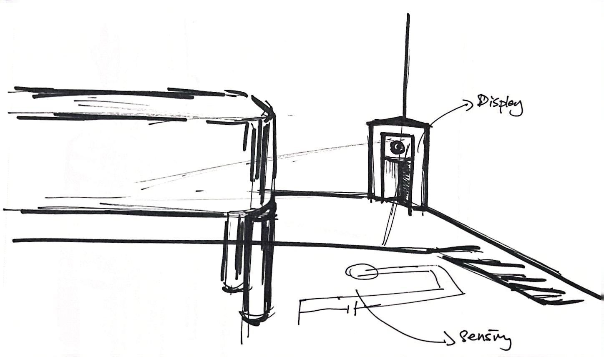
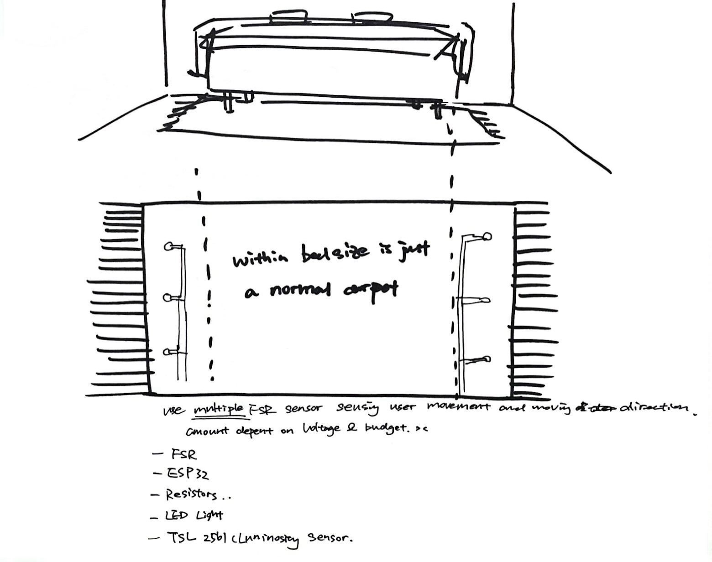
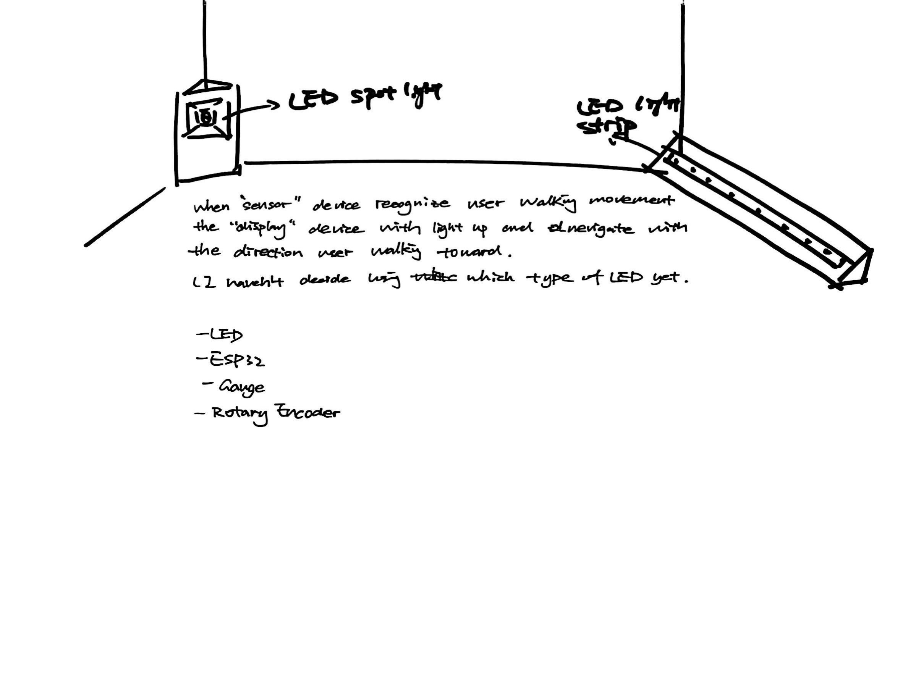
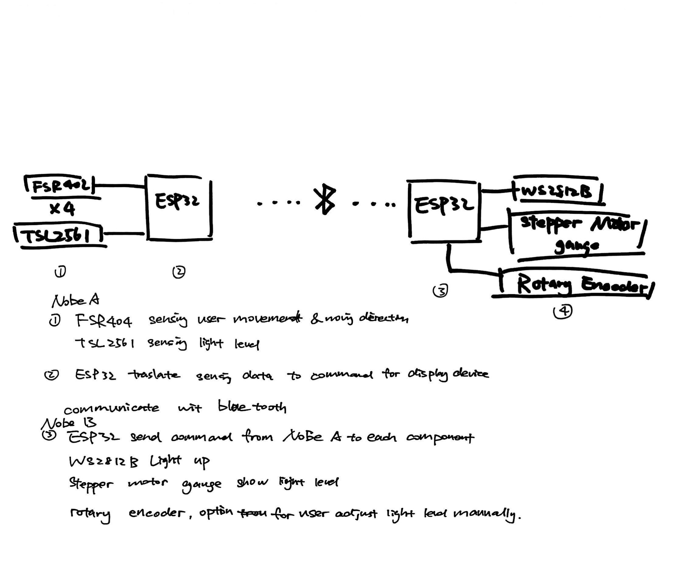

# 514A-FInalProject
## Section 1

A system to provide safe, low-brightness lighting when users get out of bed at night. 
One sensing device shaped like a carpet and one displaying device can be place at the corner of the room to light the path for user.

## Section 2

## Section 3

## Section 4

